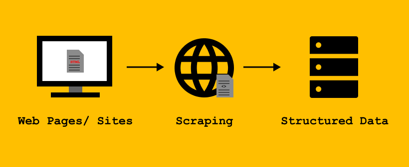

# Web-Scraping-
 Web Scraping of Amazon & Hatla2ee websites
 
## 📝 Table of Contents
- [System Architecture](#-system-architecture)
- [Setup & Requirements](#-setup--requirements)
- [Usage](#-usage)
- [Features](#-features)
- [Link to Project on Google Colab](#-link-to-project-on-google-colab)

## ✨ System Architecture

## 🛠 Setup & Requirements
1. **Google Account**: Ensure you have an Google account to sign in Google Colab Enviroment.
2. **Python Libraries**: Install & Import the required Python libraries:
   - request
   - time
   - compose
   - os
   - Pool
   - requests
   - BeautifulSoup
   - pandas

## 🚀 Usage
Web Scraping of Amazon & Hatla2ee websites that has many pages with beautiful soup and requests in order to create a Dataframe containing names of the products sold in the two websites, the script uses multiprocessing to reduce the duration of execution and to optimize preformance

## 📈 Features
- **System Architecture**: The pipeline is set up in order to preform ETL process on Python Enviroment.
- **Links Preparation**: The script creates a list containing links of website pages to be scraped.
- **get_items_names Function**: The function takes the webpage link and returns the link and its content items as a pair.
- **Multiprocessing Usage**: The script uses the pool library with the map function so that execution time is reduced.
- **DataFrame Creation**: the script uses pandas library to create dataframe containing 2 columns the link of webpage & the names of products sold in that link.
- **Time of Execution**: the script calculates the execution time using time library.

## 🔗 Link to Project on Google Colab
https://colab.research.google.com/drive/1STtErZ1dwAxAdZW6KYt8rbnXGk5gTFh2?usp=sharing
